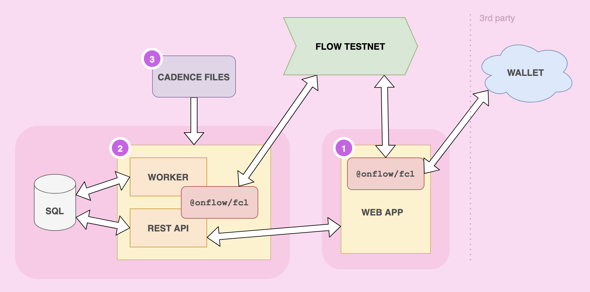

<p align="center">
    <a href="http://kitty-items-flow-testnet.herokuapp.com/">
        
    </a>
</p>

👋 欢迎! 这个演示应用程序是为了帮助你学习如何在 flow 上构建项目。

- Kitty Items 是一个使用[Cadence](https://docs.onflow.org/cadence)构建的完整的 NFT 交易市场，基于 Flow 的面向资源的智能合约编程语言。
- 学习如何部署智能合约、创建 NFT，以及将用户钱包与 Flow 客户端库(FCL)集成。

## 🎬 在线示例


查看部署在 Flow 测试网中的 [Kitty Items 的在线示例](http://kitty-items-flow-testnet.herokuapp.com/)。

## ✨ 从这里开始

### 1. 安装 Flow CLI

在开始之前需要安装 [Flow command-line interface (CLI)](https://docs.onflow.org/flow-cli).

_⚠️ 这个项目需要 `flow-cli v0.15.0` 或以上._

### 2. 克隆项目

```sh
git clone https://github.com/onflow/kitty-items.git
```

### 3. 创建 Flow 测试账户

您需要一个Testnet帐户来继续启动这个项目。下面是方法:

#### 生成密钥对


使用 Flow CLI生成一个新的密钥对:

```sh
flow keys generate
```

_⚠️ 确保把这些钥匙放在安全的地方，你以后会用到它们的。_

#### 创建账户

在 [Flow Testnet 水龙头](https://testnet-faucet-v2.onflow.org/) 创建一个新的账户. 使用在上一步生成的 **public key**。

#### 保存你的 Key

帐号创建完成后，请将地址和私钥保存到以下环境变量中:

```sh
# 替换成你自己的账户信息!
export FLOW_ADDRESS=0xabcdef12345689
export FLOW_PRIVATE_KEY=xxxxxxxxxxxx
```

### 4. 部署合约

```sh
flow project deploy --network=testnet
```

### 5. 启动 API 服务

合约部署完成后，请查看 [Kitty Items API 说明](https://github.com/onflow/kitty-items/tree/master/api#readme)
来初始化并启动 Kitty Items API 服务. 该后端服务负责初始化帐户、创建 NFTs和处理事件。

### 6. 启动 web 应用

最后参照 [Kitty Items Web 说明](https://github.com/onflow/kitty-items/tree/master/web#readme) 启动 Kitty Items 前端 React 应用。

## 项目概览



## 🔎 说明

上面是包含在每个文件夹中的这个项目的各个部分的基本图，以及每个部分如何与其他部分交互。

### 1. 网页应用 (静态 网站) | [kitty-items/web](https://github.com/onflow/kitty-items/tree/master/web)

这是一个用 React 构建的完整的 web 应用程序，演示了如何构建一个静态网站，可以部署到 IPFS 这样的环境中，并使用' @onflow/fcl '直接连接到 Flow 区块链。
不需要服务器' @onflow/fcl '使用 Cadence 脚本处理[Flow accounts](https://docs.onflow.org/concepts/accounts-and-keys/)、[signing transaction](https://docs.onflow.org/concepts/transaction-signing/) 和查询数据的身份验证和授权。
### 2. 妈妈快看, 一个 web 服务器！ | [kitty-items/api](https://github.com/onflow/kitty-items/tree/master/api)


我们喜欢去中心化，但服务器仍然是非常有用的，这一个也不例外。这个项目中的代码演示了如何使用[Flow JavaScript SDK](https://github.com/onflow/flow-js-sdk)从 Node JS 后端连接到 Flow。它还提供了许多方便的模式，您可能希望在更复杂和功能丰富的区块链应用程序中使用这些模式，比如使用 SQL 数据库(Postgres)存储和查询事件。


该API演示了如何将交易发送到 Flow 区块链，特别是用于铸造[Kibbles](https://github.com/onflow/kitty-items/blob/master/cadence/contracts/Kibble.cdc)(同质化代币)和[Kitty Items](https://github.com/onflow/kitty-items/blob/master/cadence/contracts/KittyItems.cdc)(非同质化代币)。

### 3. Cadence 代码 | [kitty-items/cadence](https://github.com/onflow/kitty-items/tree/master/cadence)

[Cadence](https://docs.onflow.org/cadence) 智能合约，脚本和交易，为方便查看。这个文件夹包含市场应用程序的所有区块链逻辑。在这里你可以找到[同质化代币](https://github.com/onflow/flow-ft)和[非同质化代币(NFT)](https://github.com/onflow/flow-nft)智能合约实现的例子，以及与它们交互的脚本和事务。它还包含了如何测试你的 Cadence 代码(用 Golang 编写的测试)的示例。

## 😺 什么是 Kitty Items?

这些 Items 是你的猫的帽子，但实际上它们是[非同质化代币 (NFTs)](https://github.com/onflow/flow-nft)，存储在 Flow 区块链上。
道具可以用同质化代币从市场购买。
在未来，您将能够将它们添加到[以太坊的 CryptoKitties](https://www.cryptokitties.co/)，并由oracle验证其所有权。

## ❓ 更多问题?

- 和团队聊天 [Flow Discord server](https://discord.gg/xUdZxs82Rz)
- 在论坛提问 [Flow community forum](https://forum.onflow.org/t/kitty-items-marketplace-demo-dapp/759/5)

---

🚀  祝 Hacking 愉快!
